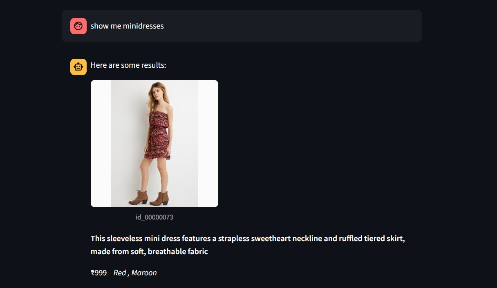

# 🧠 Multimodal Fashion Chatbot

A powerful AI-driven chatbot that understands both **text and image queries** to help users find fashion products quickly. The chatbot supports natural language input as well as image-based search using deep learning models, offering an engaging, modern experience across **web (Streamlit)** and **Android** platforms.

---

## 🚀 Features

-  **Text-Based Search** — Search fashion items using natural language (e.g., "red dress under ₹1000").
-  **Image-Based Search** — Upload a clothing image and get visually similar recommendations.
-  **LLM Query Analysis** — Filters extracted using language models for precise retrieval.
-  **Filtered Retrieval** — Category, color, and price filtering for accurate matches.
-  **FastAPI Backend** — Lightweight and asynchronous for fast response times.
-  **PostgreSQL + pgvector** — Scalable, efficient vector similarity search engine.
-  **Streamlit Frontend** — Web UI chatbot interface for demo and debugging.
-  **CLIP & Sentence Transformers** — For image-text embedding and semantic matching.

---

## 🧠 Tech Stack – With Justification

| Component       | Technology Used           | Why This?                                                                                         | Why Not Alternatives?                                                              |
|-----------------|---------------------------|---------------------------------------------------------------------------------------------------|------------------------------------------------------------------------------------|
| **Backend API** | `FastAPI`                 | Asynchronous, fast, easy to use with automatic docs via Swagger.                                  | Flask is synchronous; Django REST is overkill for lightweight microservices.       |
| **Database**    | `PostgreSQL` + `pgvector` | Powerful relational DB with support for AI embeddings and vector similarity search.               | MongoDB lacks built-in vector search; SQLite not scalable.                         |
| **Text Model**  | `SentenceTransformer`     | Pre-trained transformer embeddings for capturing semantic meaning of queries.                     | Traditional TF-IDF/BERT lacks vector similarity integration out-of-the-box.        |
| **Image Model** | `CLIP` (`ViT-B/32`)       | Converts images to embeddings in the same space as text queries — perfect for multimodal tasks.   | CNNs like ResNet don't align text & image in same space.                           |
| **Frontend**    | `Streamlit`               | Rapid prototyping of interactive web apps with almost zero boilerplate.                           | React/Vue needs more setup and backend integration for this phase.                 |                          |
| **Hosting**     | `Uvicorn` (local)         | Fast ASGI server to serve FastAPI apps with hot-reload support.                                   | Gunicorn lacks ASGI compatibility directly.                                        |

---

## 📂 Project Structure
```multimodal-chatbot/
│
├── backend/
│ ├── main.py # FastAPI routes
│ ├── query_analysis.py # LLM-based filter extraction
│ ├── filtered_retrieval.py # Semantic + filter search
│ ├── image_retrieval.py # Image embeddings & match
│ ├── db_utils.py # PostgreSQL connection
│ └── requirements.txt
│
├── frontend/
│ └── app.py # Streamlit chatbot interface
│
├── android/
│ └── ChatbotActivity.java # Android UI + API calls
│
├── data/
│ ├── product_images/ # Images of fashion items
│ └── products.json # Metadata (name, price, category)
│
└── README.md
```

---

## ⚙️ Setup Instructions

### 1. Clone the repository
```bash
git clone https://github.com/yourusername/multimodal-chatbot.git

```
```
cd multimodal-chatbot
```

2. Setup Python Environment
```bash
python -m venv venv
source venv/bin/activate      # or venv\Scripts\activate (Windows)
pip install -r backend/requirements.txt
````
3. Run the FastAPI Backend
```bash

cd backend
uvicorn main:app --reload --port 8000
```
Swagger Docs → http://localhost:8000/docs

4. Start Streamlit Frontend
```bash
cd frontend
streamlit run app.py
```

🔍 Sample Queries
"Show me black heels under ₹2000"

Upload an image of a hoodie and say "something like this"

"I want a yellow saree"

📸 Screenshots (Add Yours Here)
Streamlit UI	




💡 Future Improvements
- Voice-based search using Whisper
- Live product scraping from e-commerce APIs
- Real-time chat with WebSockets

📜 License
This project is licensed under the MIT License — feel free to use, modify, and distribute.

👤 Author : PriiiAiVerse


